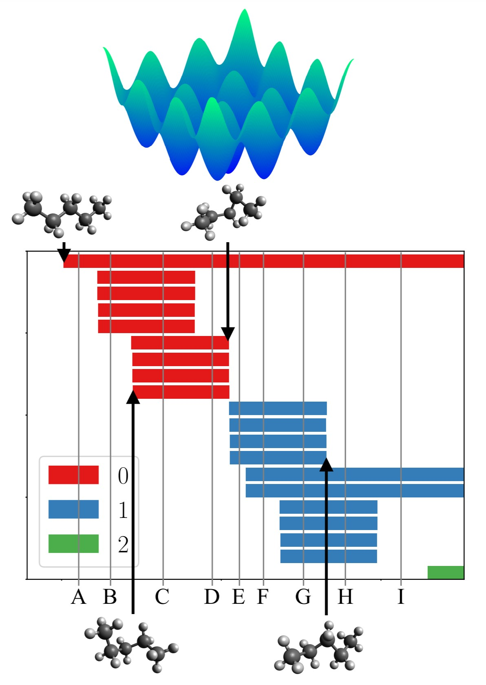

Currently I study applications of machine learning, topological, and geometric data analysis to medical and physiological data. As a PhD student at Colorado State University I worked with Dr. Henry Adams on the theory of Vietoris&ndash;Rips complexes in applied topology. A few of the more interesting projects from my academic work are listed below.

## Chemical Energy Landscapes and Persistent Homology

My co-authors and I showed that with a particular model of intramolecular forces (the OPLS-UA force field) the energy landscape of any n-alkane molecule is (in a sense made precise by Morse theory) the _tensor product_ of $$k$$ copies of the energy landscape of butane. The energy landscape of butane is simple enough to compute analytically, and the Künneth formula for persistent homology allows us to generalize this computation to all n-alkanes. There is a lot of fun mathematics stuffed into the appendix of this paper. This was part of the NSF-funded [Delta Topology](https://delta-topology.org) project. Several members of this team are currently working on extending this project to other configurations of alkane molecules (as of December 2021).

* "Representations of Energy Landscapes by Sublevelset Persistent Homology: An Example with n-Alkanes." Joshua Mirth, Yanqin Zhai, Johnathan Bush, Enrique G Alvarado, Howie Jordan, Mark Heim, Bala Krishnamoorthy, Markus Pflaum, Aurora Clark, Y Z, and Henry Adams. _Journal of Chemical Physics_ 154 (2021), 114114. ([Publisher Link](https://doi.org/10.1063/5.0036747), [Preprint Link](https://arxiv.org/abs/2011.00918))

<!---
Abstract:
_Encoding the complex features of an energy landscape is a challenging task, and often chemists pursue the most salient features (minima and barriers) along a highly reduced space, i.e. 2- or 3-dimensions. Even though disconnectivity graphs or merge trees summarize the connectivity of the local minima of an energy landscape via the lowest-barrier pathways, there is more information to be gained by also considering the topology of each connected component at different energy thresholds (or sublevelsets). We propose sublevelset persistent homology as an appropriate tool for this purpose. Our computations on the configuration phase space of n-alkanes from butane to octane allow us to conjecture, and then prove, a complete characterization of the sublevelset persistent homology of the alkane CmH2m+2 potential energy landscapes, for all m, and in all homological dimensions. We further compare both the analytical configurational potential energy landscapes and sampled data from molecular dynamics simulation, using the united and all-atom descriptions of the intramolecular interactions. In turn, this supports the application of distance metrics to quantify sampling fidelity and lays the foundation for future work regarding new metrics that quantify differences between the topological features of high-dimensional energy landscapes._
-->

## Vietoris--Rips Simplicial Complexes and Metric Thickenings

Applied topologists like to use the [Vietoris&ndash;Rips construction](https://jeremykun.com/tag/vietoris-rips-complex/) to turn point cloud data into filtrations of simplicial complexes. It is desirable mathematically to understand what happens with this construction in the limit when the point cloud becomes a full surface. Several of my papers, including my PhD thesis, look at this problem. In particular, I focused on understanding the [Vietoris&ndash;Rips _metric thickening_](https://www.math.colostate.edu/~adams/research/MetricReconstructionViaOptimalTransport.pdf) which uses optimal transport theory to make the limiting simplicial complex a metric space (via the Wasserstein metric). My results were limited to showing that in certain circumstances the limit gives the "right answer" and the Vietori&ndash;Rips metric thickening has the same topology as the surface. We also started to develop a funky categorical approach to some of these problems, which feels like a nice language for future work to use. Much stronger results have recently been obtained by my advisor, his graduate students, and other collaborators, in particular [this paper](https://arxiv.org/abs/2109.15061).

* "Operations on Metric Thickenings." Henry Adams, Johnathan Bush, and Joshua Mirth. In: Spivak, D., Vicary, J. (eds), _Applied Category Theory, Electronic Proceedings in Theoretical Computer Science_ 333:261-275 (2021). ([Publisher Link](http://dx.doi.org/10.4204/EPTCS.333.18) [Preprint Link](https://arxiv.org/abs/2101.10489))
* "Vietoris&ndash;Rips Metric Thickenings and Wasserstein Spaces." Joshua Mirth. PhD Thesis, Colorado State University Department of Mathematics, 2020. ([PDF Link](files/thesis.pdf))
* "Metric Thickenings of Euclidean Submanifolds." Henry Adams and Joshua Mirth. _Topology and its Applications_ 254 (2019), 69-84. ([Publisher link](https://authors.elsevier.com/a/1YKoTbyCKVqOm), [Preprint Link](https://arxiv.org/abs/1709.02492), [Master's Thesis](files/masters.pdf))

<!---
Abstract: _Many simplicial complexes arising in practice have an associated metric space structure on the vertex set but not on the complex, e.g. the Vietoris–Rips complex in applied topology. We formalize a remedy by introducing a category of simplicial metric thickenings whose objects have a natural realization as metric spaces. The properties of this category allow us to prove that, for a large class of thickenings including Vietoris&ndash;Rips and Čech thickenings, the product of metric thickenings is homotopy equivalent to the metric thickenings of product spaces, and similarly for wedge sums. In addition, we study a Dowker-type theorem for simplicial thickenings._
-->

## Persistent Homology Fractal Dimension

Persistent homology effectively captures the global topological structure of a point cloud, but to many people's surprise it also [captures quite a bit of information about local "texture"](https://arxiv.org/abs/2103.05796). Fractals are probably the most obviously textural geometric objects, so we leveraged persistent homology to define a new notion of fractal dimension, which agrees with the classical definitions. We prove this in some cases, verify it computationally in others, and of course, those classical definitions don't always agree with each other anyway! Nice extensions of this idea have been done by several people, including [Ben Schweinhart](https://scholar.google.com/scholar?as_q=fractal&as_epq=&as_oq=&as_eq=&as_occt=any&as_sauthors=schweinhart&as_publication=&as_ylo=&as_yhi=&hl=en&as_sdt=0%2C24).

* "A fractal dimension for measures via persistent homology." Henry Adams, Manuchehr Aminian, Elin Farnell, Michael Kirby, Joshua Mirth, Rachel Neville, Chris Peterson, and Clayton Shonkwiler. _Abel Symposia_ (2019). ([Publisher Link](https://doi.org/10.1007/978-3-030-43408-3_1), [Preprint Link](https://arxiv.org/abs/1808.01079))

<!---
Abstract: We use persistent homology in order to define a family of fractal dimensions, denoted \(\dim_{\text{PH}}^i(\mu)\) for each homological dimension \(i\ge 0\), assigned to a probability measure \(\mu\) on a metric space.
The case of \(0\)-dimensional homology (\(i=0\)) relates to work by Michael J Steele (1988) studying the total length of a minimal spanning tree on a random sampling of points.
Indeed, if \(\mu\) is supported on a compact subset of Euclidean space \(\mathbb{R}^m\) for \(m\ge2\), then Steele's work implies that \(\dim_{\text{PH}}^0(\mu)=m\) if the absolutely continuous part of \(\mu\) has positive mass, and otherwise \(\dim_{\text{PH}}^0(\mu) \lt m\). Experiments suggest that similar results may be true for higher-dimensional homology \(0 \lt i \lt m\), though this is an open question.
Our fractal dimension is defined by considering a limit, as the number of points \(n\) goes to infinity, of the total sum of the \(i\)-dimensional persistent homology interval lengths for \(n\) random points selected from \(\mu\) in an i.i.d. fashion.
To some measures \(\mu,\) we are able to assign a finer invariant, a curve measuring the limiting distribution of persistent homology interval lengths as the number of points goes to infinity.
We prove this limiting curve exists in the case of \(0\)-dimensional homology when \(\mu\) is the uniform distribution over the unit interval, and conjecture that it exists when \(\mu\) is the rescaled probability measure for a compact set in Euclidean space with positive Lebesgue measure.
-->

## Topology of Optical Flow

[Optical flow](https://en.wikipedia.org/wiki/Optical_flow) is of great interest in video imaging. My co-authors and I took a dataset with high-quality optical flow data and used zig-zag persistent homology to determine its topological structure, which we found to be a torus. There is a nice interpretation of this result relating to the type of camera motion typical of the video. 

* "On the nonlinear statistics of optical flow." Henry Adams, Johnathan Bush, Brittany Carr, Lara Kassab, and Joshua Mirth. _Proceedings of Computational Topology in Image Context_, LNCS volume 11382 (2019), 151-165. ([Publisher Link](https://doi.org/10.1007/978-3-030-10828-1_12), [Preprint Link](https://arxiv.org/abs/1812.00875))

